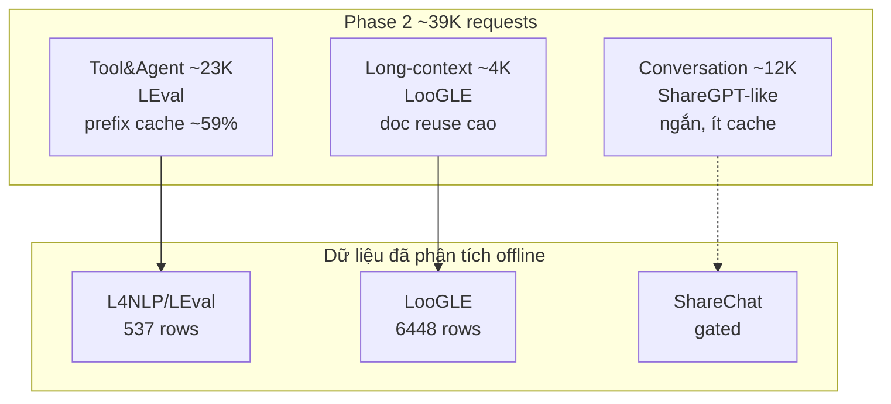

# Báo cáo phân tích tổng hợp  
## LLM Inference Optimization Challenge V2 — AI RACE 2026

**Phiên bản:** 1.0  
**Ngày:** 2026-06-01  
**Nguồn đề thi:** `air_data/LLM_Inference_Optimization_Challenge_v2 (1).docx`  
**Nguồn phân tích dữ liệu:** `air_data/data/hf/`, `contest_report.json`, `inference_research_report.json`  
**Công cụ:** `down_data.py`, `analyze_data.py`, `analyze_inference.py`

---

## Mục lục

1. [Tóm tắt điều hành](#1-tóm-tắt-điều-hành)
2. [Bối cảnh cuộc thi (theo đề bài V2)](#2-bối-cảnh-cuộc-thi-theo-đề-bài-v2)
3. [Ánh xạ dataset thực tế ↔ workload cuộc thi](#3-ánh-xạ-dataset-thực-tế--workload-cuộc-thi)
4. [Kết quả phân tích dữ liệu đã tải](#4-kết-quả-phân-tích-dữ-liệu-đã-tải)
5. [Phân tích tối ưu inference (researcher view)](#5-phân-tích-tối-ưu-inference-researcher-view)
6. [Đối chiếu: đề thi nói gì vs dữ liệu chứng minh gì](#6-đối-chiếu-đề-thi-nói-gì-vs-dữ-liệu-chứng-minh-gì)
7. [Suy luận & chiến lược theo Phase](#7-suy-luận--chiến-lược-theo-phase)
8. [Rủi ro, giả định và việc cần làm tiếp](#8-rủi-ro-giả-định-và-việc-cần-làm-tiếp)
9. [Kết luận — đúc kết cho đội thi](#9-kết-luận--đúc-kết-cho-đội-thi)
10. [Phụ lục: bảng số liệu](#10-phụ-lục-bảng-số-liệu)

---

## 1. Tóm tắt điều hành

Cuộc thi **LLM Inference Optimization Challenge V2** không đo độ chính xác mô hình thuần túy, mà đo khả năng **phục vụ LLM trong điều kiện production**: tối đa hóa **Effective Request Capacity (ERC)** — tỷ lệ request vừa đạt **SLO latency** (TTFT + TBT) vừa không làm giảm chất lượng quá ngưỡng (**accuracy gate ≤ 2%** so với baseline MXFP4).

Phân tích offline trên hai benchmark mà BTC công bố là nguồn probe (**LEval**, **LooGLE**) cho thấy:

| Phát hiện | Ý nghĩa cho cuộc thi |
|-----------|----------------------|
| **Prefill chiếm phần lớn chi phí** (context dài, output ngắn) | Tối ưu KV/prefix cache, chunked prefill quan trọng hơn tối ưu decode |
| **LooGLE: ~87–95% context trùng lặp** nếu group theo `doc_id` | Phase 2 Long-context (~4K request) — lợi thế lớn nếu schedule theo document |
| **LEval Tool&Agent: gsm100 có `input` 100% giống nhau** | Khớp đề thi “prefix caching ~59%” — few-shot/system prompt lặp |
| **Hầu hết subset LEval khác: mỗi row context khác** | Không thể batch reuse giữa các request; cần kernel long-context + VRAM |
| **Phase 1 không có Long-context** | Tập trung prefix caching + Tool&Agent (LEval-like), không cần 100K context trên 20B |

**Đúc kết một câu:** Thắng cuộc thi = **tối đa hóa ERC trên Mooncake trace** bằng cách khai thác **prefix/KV reuse** (Tool&Agent + Long-context) trong khi **không vượt accuracy gate**, với Phase 1 là bài luyện tập thu nhỏ (20B, 4×H200, ~2K request, không long-context).

---

## 2. Bối cảnh cuộc thi (theo đề bài V2)

### 2.1. Cấu trúc hai phase

| Phase | Thời gian | Hình thức | Model | GPU | Workload | Metric |
|-------|----------|-----------|-------|-----|----------|--------|
| **Phase 1 — Online Qualifier** | 2 tuần | Online, portal | `gpt-oss-20b` | 4×H200 / submission | Mini-trace ~2.000 req (Conv 60% + Tool&Agent 40%) | `Score_P1 = 100 × ERC × f(Δ)` |
| **Phase 2 — Final Hackathon** | 3 ngày | Onsite | `gpt-oss-120b` | 8×H200 / đội | Full trace ~39.000 req (3 workload) | Cùng công thức |

- **Top 12** Phase 1 vào Final.
- **Submission Phase 1:** tối đa 3 lần/ngày/đội; bench ~12–15 phút/lần.

### 2.2. Metric chính: ERC và accuracy

**Request effective** khi đồng thời:

1. `TTFT ≤ SLO_TTFT`
2. `TBT ≤ SLO_TBT`
3. `output_length ≥ 1` token

```
ERC = N_effective / N_total   (N_total sau khi loại 10% warmup)
Score = 100 × ERC × f(accuracy_drop)
```

**Accuracy gate (hard):** `accuracy_drop ≥ 2%` → `Score = 0`.

**Hàm `f(Δ)` (piecewise linear):**

| accuracy_drop Δ | f(Δ) |
|-----------------|------|
| ≤ 0.5% | 1.0 |
| 0.5% – 1.5% | giảm tuyến tính 1.0 → 0.5 |
| 1.5% – 2.0% | giảm tuyến tính 0.5 → 0 |
| ≥ 2.0% | 0 (fail) |

**SLO (calibrate qua dry-run, không cố định cứng):**

| Phase | TTFT (đề xuất) | TBT (đề xuất) | Nguyên tắc |
|-------|----------------|---------------|------------|
| P1 | ~1–4s (TBD) | ~40–100ms (TBD) | Reference vLLM default đạt ERC ~40–60% |
| P2 | ~5–15s (TBD) | ~100–250ms (TBD) | Tương tự trên 120B / 8×H200 |

### 2.3. Workload Mooncake trace (đề thi Section 7)

**Phase 2 — Full trace (~39.000 request, ~50–60 phút replay):**

| Workload | Dataset gốc (đề thi) | % request | Input median / p95 (token) | Output median / p95 | Đặc điểm |
|----------|----------------------|-----------|----------------------------|---------------------|----------|
| **Conversation** | ShareGPT | ~31% (~12K) | 320 / 1.200 | 180 / 850 | Ngắn, ít prefix reuse |
| **Tool & Agent** | **LEval** | ~59% (~23K) | 8.600 / 18.400 | 60 / 220 | System prompt dài, **prefix cache ~59%** |
| **Long-context** | **LooGLE** | ~10% (~4K) | 15.000 / 78.000 | 450 / 1.800 | Document QA, tới ~100K token |

**Phase 1 — Mini-trace (~2.000 request):**

| Workload | Số request | Ghi chú |
|----------|------------|---------|
| Conversation | ~1.200 (60%) | Giữ pattern ngắn |
| Tool & Agent | ~800 (40%) | Giữ distribution input LEval-like |
| Long-context | **0** | Cố ý loại — 20B không đủ VRAM >40K trên cấu hình P1 |

**Trace format (JSONL):** `timestamp`, `input_length`, `output_length`, `hash_ids` (hash mỗi block 512 token — request cùng `hash_ids` → có thể share KV).

### 2.4. Accuracy probe

| Phase | Conversation | Tool&Agent | Long-context | Tổng probe |
|-------|--------------|------------|--------------|------------|
| P1 | 0 | ~80 (LEval QA) | N/A | ~80 |
| P2 | 0 | ~1.500 (LEval) | ~400 (LooGLE) | ~1.900 |

**Metric probe:**

| Workload | Nguồn | Metric | Task mix |
|----------|-------|--------|----------|
| Tool&Agent | LEval Single-doc QA | F1, EM | 60% |
| Tool&Agent | LEval Multi-doc QA | F1 | 40% |
| Long-context | LooGLE Short-dep QA | F1, ROUGE-L | 50% |
| Long-context | LooGLE Long-dep QA | F1, ROUGE-L | 50% |

### 2.5. Kỹ thuật được khuyến khích (Section 10)

- Weight quant: FP8, INT8, native MXFP4 (120B)
- **KV cache quant, prefix caching, semantic caching**
- Continuous batching, chunked prefill
- Framework: vLLM, SGLang, TensorRT-LLM
- TP/PP, NCCL tuning (8×H200 Phase 2)
- **Cấm:** pre-compute đáp án trace, external network khi serve, sửa tokenizer

---

## 3. Ánh xạ dataset thực tế ↔ workload cuộc thi

Repo `air_data/data/data_hf.txt` liệt kê ba nguồn Hugging Face — **trùng khớp trực tiếp** với đề thi Section 7:

| Repo HF (đã phân tích) | Vai trò trong cuộc thi | Probe / workload |
|------------------------|------------------------|------------------|
| **L4NLP/LEval** | Tool & Agent (~59% P2 traffic) | ~80 probe P1, ~1500 probe P2; F1/EM |
| **bigai-nlco/LooGLE** | Long-context (~10% P2) | ~400 probe P2; F1/ROUGE-L |
| **tucnguyen/ShareChat** | Liên quan Conversation (đề ghi ShareGPT; ShareChat gated — chưa tải) | Không probe trực tiếp P1 |

**Mooncake trace** (BTC phát) ≠ file JSONL benchmark — trace chỉ mô phỏng **độ dài, arrival, hash reuse**; probe lấy câu hỏi từ LEval/LooGLE.



---

## 4. Kết quả phân tích dữ liệu đã tải

### 4.1. L4NLP/LEval (537 mẫu)

| Nhóm | Số mẫu | Vai trò |
|------|--------|---------|
| Exam | 292 | QA / reasoning, output ngắn |
| Generation | 245 | Summarization, output dài |

**Schema:** `input` (context + few-shot), `instructions` (câu hỏi), `outputs` (gold), `evaluation`, `source`.

**Subset Exam — độ dài trung bình `input` (ký tự):**

| File | n | input mean | instructions mean | outputs mean | Gợi ý task |
|------|---|------------|-------------------|--------------|------------|
| gsm100 | 100 | 16.795 | 267 | 2 | Math, đáp số ngắn |
| quality | 15 | 24.570 | 4.590 | 936 | MCQ |
| codeU | 90 | 100.059 | 173 | 15 | Code hiểu repo dài |
| topic_retrieval_longchat | 50 | 56.372 | 282 | 113 | Retrieval topic |
| coursera | 15 | 39.206 | 3.477 | 31 | QA transcript |
| sci_fi | 7 | 59.891 | 1.549 | 174 | QA sci-fi |
| tpo | 15 | 16.181 | 5.529 | 35 | QA |

**Subset Generation — nặng nhất:**

| File | n | input mean (chars) | outputs mean |
|------|---|-------------------|--------------|
| narrative_qa | 23 | 215.417 (~54k tok*) | 495 |
| legal_contract_qa | 23 | 110.969 (~28k tok*) | 2.699 |
| review_summ | 24 | 80.515 | 3.506 |

\*Ước lượng 4 chars/token.

### 4.2. bigai-nlco/LooGLE (6.448 mẫu test)

| Config | Rows | Unique docs | Q/doc (mean) | Context mean (chars) | Context p99 (~tok) |
|--------|------|-------------|--------------|----------------------|------------------|
| longdep_qa | 1.101 | 140 | 7.9 | 116.777 | ~55.724 |
| shortdep_qa | 1.951 | 105 | 18.6 | 99.986 | ~62.362 |
| shortdep_cloze | 2.880 | 155 | 18.6 | 127.623 | ~61.444 |
| summarization | 516 | 516 | 1.0 | 90.754 | ~73.294 |

**Schema:** `context`, `question`, `answer`, `evidence`, `doc_id`, `task`, `title`.

### 4.3. tucnguyen/ShareChat

- **Chưa tải** (dataset gated trên Hugging Face).
- Cần `huggingface-cli login` + chấp nhận license trước khi bổ sung phân tích Conversation.

---

## 5. Phân tích tối ưu inference (researcher view)

### 5.1. Mô hình chi phí

```
Chi phí_serving ≈ Σ (Prefill(input_tokens)) + Σ (Decode(output_tokens))
```

Với dữ liệu đo được:

| Dataset | Tỷ lệ answer/context (mean) | Kết luận |
|---------|----------------------------|----------|
| LooGLE longdep_qa | ~0.05% | Prefill-dominated |
| LEval gsm100 | output ~2 chars vs input ~17k chars | Prefill-dominated; decode cực ngắn |
| LEval Generation (summ) | output lớn hơn nhưng vẫn << context | Prefill vẫn chính |

**→ Tối ưu TTFT (prefill) và KV reuse quan trọng hơn tối ưu TBT decode dài.**

### 5.2. Hai kiểu “reuse” khác nhau

#### A. LooGLE — reuse theo **document** (`doc_id`)

- Cùng `doc_id` → **context byte-identical** (140/140 doc uniform trong longdep_qa).
- **Tiết kiệm prefill ước tính:**
  - longdep_qa: **87.2%**
  - shortdep_qa: **94.9%**
  - shortdep_cloze: **94.6%**
  - summarization: **0%** (1 câu/doc)

**Cơ chế triển khai:** Radix/prefix cache theo prefix `context`; scheduler xếp hàng theo `doc_id`; multi-query per prefill.

**Khớp đề thi:** Long-context p95 **78.000 token** — dữ liệu LooGLE p99 ~55k–73k token (ước lượng) **cùng bậc**.

#### B. LEval — reuse theo **few-shot / system prompt** (`input`)

| Pattern | Ví dụ | Prefill savings | Cơ chế |
|---------|-------|-----------------|--------|
| **HIGH** — toàn bộ `input` giống | gsm100 (100/100) | **~97.5%** | 1 lần prefill few-shot, 100 lần đổi `instructions` |
| **LOW** — mỗi row `input` khác | codeU, narrative_qa, quality, … | 0% cross-row | Full prefill mỗi request |

**Khớp đề thi:** Tool&Agent median input **8.600 token**, prefix cache ratio **~59%** — gsm100 và session LEval mô phỏng đúng “system prompt dài lặp lại”.

**Mooncake `hash_ids`:** Hai request Tool&Agent chia sẻ block hash [46–57] trong sample đề thi = cùng system prompt → **cùng logic với prefix caching**.

### 5.3. Ma trận ưu tiên kỹ thuật

| Kỹ thuật | Phase 1 | Phase 2 | Lý do từ phân tích |
|----------|---------|---------|-------------------|
| **Prefix / radix caching** | ★★★★★ | ★★★★★ | LEval-like + 59% T&A traffic |
| **Paged KV, FP8/INT8 KV** | ★★★★ | ★★★★★ | VRAM cho input 8K–78K |
| **Schedule theo hash/doc** | ★★★ | ★★★★★ | LooGLE doc_id; Mooncake hash_ids |
| **Chunked prefill** | ★★★ | ★★★★ | Context p99 lớn |
| **Continuous batching** | ★★★★ | ★★★★★ | Bursty arrival (Kimi trace) |
| **Quant weight (FP8/MXFP4)** | ★★★ | ★★★★ | 120B trên 8×H200 |
| **Giảm max_new_tokens** | ★★★ | ★★★ | Probe T&A output ngắn (60/220 tok p50/p95) |
| **Long-context 100K** | ✗ (không có trong P1) | ★★★★★ | ~4K req LooGLE-like |

---

## 6. Đối chiếu: đề thi nói gì vs dữ liệu chứng minh gì

| Khẳng định đề thi V2 | Bằng chứng từ phân tích offline | Mức tin cậy |
|----------------------|----------------------------------|-------------|
| Tool&Agent có prefix caching ~59% | LEval `gsm100`: 100% shared `input`; nhiều subset khác unique per row | **Cao** (pattern rõ trên gsm100; tổng thể cần Mooncake trace) |
| Long-context tới ~100K token | LooGLE p99 ~55k–73k tok (est.); narrative_qa LEval ~54k tok mean | **Cao** |
| Long-context output dài hơn T&A | LooGLE summarization answer ~1.259 chars mean vs QA ~23–64 | **Trung bình** (khớp hướng; probe mix 50/50 short/long dep) |
| P1 không có long-context | Không cần tối ưu 100K trên 20B trong 2 tuần đầu | **Chắc** (đề thi explicit) |
| ERC phụ thuộc TTFT + TBT | Prefill dài → TTFT là nút thắt; output ngắn T&A → TBT ít token | **Cao** |
| Accuracy probe từ LEval/LooGLE | Đã có format QA: `instructions`+`input` / `context`+`question` | **Cao** |
| `hash_ids` cho cache reuse | Tương đương `doc_id` (LooGLE) và shared `input` (LEval gsm100) | **Cao** (khái niệm) |

---

## 7. Suy luận & chiến lược theo Phase

### 7.1. Phase 1 — Online Qualifier (ưu tiên vào top 12)

**Mục tiêu:** `Score_P1 = 100 × ERC_P1 × f(Δ)` trên ~2.000 request, **không có long-context**.

| Hạng mục | Chiến lược |
|----------|------------|
| **Workload** | 60% Conversation (prefill ngắn, throughput) + 40% Tool&Agent (prefix cache) |
| **Stack** | vLLM/SGLang, TP=4 trên 4×H200, OpenAI-compatible API |
| **Bắt buộc** | Bật prefix caching; verify 4 GPU active; server stable ≥20 phút |
| **ERC** | Giảm TTFT trên prefill 8K–18K token (T&A); giữ TBT ổn với output ~60–220 token |
| **Accuracy** | ~80 probe LEval — không quant quá agressive (Δ < 2%); baseline MXFP4 |
| **Luyện offline** | LEval `gsm100` (prefix 1→100Q), subset T&A ngắn; **bỏ qua** LooGLE 100K trong P1 |
| **Self-bench** | Dùng `trace_phase1_public.jsonl` khi BTC release; mô phỏng `hash_ids` grouping |

**Điều **không** nên làm P1:** Tối ưu 78K context, offload KV sang CPU cho 100K (không có workload); sacrifice accuracy để tăng ERC.

### 7.2. Phase 2 — Final Hackathon

**Mục tiêu:** ERC trên ~39.000 request, 3 workload, `gpt-oss-120b`, 8×H200.

| Workload | % | Chiến lược inference | Liên hệ dataset đã phân tích |
|----------|---|----------------------|------------------------------|
| **Conversation** | ~31% | Continuous batching, prefill ngắn nhanh | ShareChat/ShareGPT — ít reuse |
| **Tool & Agent** | ~59% | **Prefix cache / radix tree**; schedule theo `hash_ids` | LEval — gsm100 pattern; input 8.6K–18.4K p95 |
| **Long-context** | ~10% | **Group theo document**; 1 prefill → N câu hỏi; KV quant | LooGLE — 87–95% savings; p95 ~78K tok |

**Accuracy (~1.900 probe):**

- Giữ Δ < 0.5% nếu có thể (f(Δ)=1.0).
- LEval probe: F1/EM — output ngắn, tránh hallucination dài.
- LooGLE probe: 50% shortdep + 50% longdep — cân bằng retrieval gần/xa.

**Timeline 3 ngày (gợi ý):**

- **Day 1:** ERC baseline + mid dry-run; xác nhận SLO chính thức.
- **Day 2:** Tối ưu prefix cache + LooGLE scheduler; quant KV nếu cần VRAM.
- **Day 3:** Polish accuracy; ablation ERC vs Δ.

### 7.3. Lộ trình luyện tập offline (trước khi có trace BTC)

| Bước | Dataset | Mục đích |
|------|---------|----------|
| 1 | LEval `gsm100` | Hiểu format probe + test prefix cache 100Q/1 prefill |
| 2 | LEval `quality`, `coursera` | Probe-style QA, output format |
| 3 | LooGLE `shortdep_qa` | Scheduler theo `doc_id`, đo prefill reuse |
| 4 | LooGLE `longdep_qa` | Khó retrieval — không nhầm với shortdep |
| 5 | LEval Generation (1–2 file) | Output dài, TBT nhiều token hơn |
| 6 | ShareChat (sau login) | Conversation tiếng Việt nếu có |

---

## 8. Rủi ro, giả định và việc cần làm tiếp

### 8.1. Giả định

- Ước lượng **4 chars/token** — model tokenizer thật có thể lệch ±20–30%.
- Probe contest **sample từ** LEval/LooGLE nhưng **không trùng** 100% row đã tải.
- Mooncake trace **đã điều chỉnh** độ dài so với raw HF — dùng trace BTC làm source of truth cho ERC simulation.

### 8.2. Rủi ro

| Rủi ro | Hậu quả | Giảm thiểu |
|--------|---------|------------|
| Quant quá mạnh | Δ ≥ 2% → Score = 0 | Ablation accuracy trên probe subset |
| Bỏ prefix cache | ERC thấp trên 59% T&A traffic | Bật radix cache; log cache hit rate |
| Shuffle random LooGLE-like | Mất 87–95% prefill savings | Sort by `doc_id` / `hash_ids` |
| Chỉ tối ưu TTFT, TBT xấu | Request fail SLO dù TTFT ok | Monitor TBT median trên output 200+ token |
| P1 dùng 1 GPU | Fail rule BTC | manifest `gpus=4`, NCCL/TP |

### 8.3. Việc cần làm tiếp

- [ ] Tải **ShareChat** sau khi có HF token.
- [ ] Khi BTC release: `trace_phase1_public.jsonl`, `probe_distribution_spec.json`, `decoder_config.json`.
- [ ] Xây **simulator ERC** đơn giản: replay timestamp + model prefill time theo `input_length`.
- [ ] Chạy `analyze_inference.py` trên ShareChat sau khi tải.
- [ ] Viết **báo cáo kỹ thuật Phase 2** (≤4 trang) theo mục 12.2.3 đề thi.

**Lệnh tái tạo số liệu:**

```bash
cd air_data
python3 src/data/analyze_data.py --json-out data/contest_report.json
python3 src/data/analyze_inference.py --json-out data/inference_research_report.json
```

---

## 9. Kết luận — đúc kết cho đội thi

### 9.1. Bản chất cuộc thi

Đây là cuộc thi **serving systems**, không phải cuộc thi **fine-tune LLM**. Điểm số phụ thuộc **ERC** (bao nhiêu request sống sót SLO dưới load thật), có ràng buộc **accuracy không được tụt quá 2%**.

### 9.2. Ba điều dữ liệu offline dạy cho đội

1. **Chi phí nằm ở prefill (context dài), không phải decode.**  
   → FlashAttention, chunked prefill, KV/prefix cache trước mọi thứ khác.

2. **Reuse có hai dạng — phải tách pipeline:**  
   - **LEval / Tool&Agent:** reuse **cùng system prompt / few-shot** (`input` hoặc `hash_ids` đầu trace).  
   - **LooGLE / Long-context:** reuse **cùng document** (`doc_id`).

3. **Phase 1 và Phase 2 cùng kỹ năng, khác scale:**  
   P1 = học prefix cache + multi-GPU + ERC trên 20B; P2 = thêm long-context 100K + 120B + 8 GPU.

### 9.3. Công thức chiến lược tổng

```
Score_max ≈ max(ERC)  subject to  accuracy_drop < 2%
ERC_max   ≈ f(prefix_cache_hit, prefill_latency, batching, SLO_headroom)
```

**Hành động có ROI cao nhất:**

| Ưu tiên | Hành động |
|---------|-----------|
| 1 | Bật và tune **prefix caching** (vLLM/SGLang radix) — ảnh hưởng ~59% traffic P2 |
| 2 | **Scheduler** theo `hash_ids` / `doc_id` — đặc biệt LooGLE (~4K req nhưng prefill cực đắt) |
| 3 | **Quant KV / weight** có kiểm soát — chỉ khi vẫn pass accuracy probe |
| 4 | **Continuous batching** + NCCL TP=8 (P2) — throughput dưới bursty trace |
| 5 | Self-bench ERC trên `trace_phase1_public` trước mỗi submit (3/ngày P1) |

### 9.4. Câu trả lời cho câu hỏi “Từ phân tích này suy luận được gì?”

| Câu hỏi | Suy luận |
|---------|----------|
| Dataset HF có liên quan gì đến thi? | **Có** — LEval & LooGLE là nguồn probe và đại diện 69% traffic P2 (T&A + LC). |
| Tối ưu gì trước? | **Prefix/KV reuse + prefill latency**, không phải decode dài. |
| P1 tập trung gì? | Tool&Agent + Conversation; **prefix cache**; không long-context. |
| P2 khác P1 ở đâu? | +10% long-context LooGLE; 120B; 8 GPU; ~1.900 probe; SLO chặt hơn. |
| Làm sao không bị 0 điểm? | **Không** để accuracy_drop ≥ 2%; verify server stable và 4/8 GPU dùng hết. |
| Luyện offline thế nào? | gsm100 → shortdep_qa (group doc) → longdep_qa → vài file LEval Generation. |

---

## 10. Phụ lục: bảng số liệu

### A. LooGLE — prefill reuse

| Config | Rows | Unique docs | Q/doc mean | Prefill savings | Context mean (est. tok) |
|--------|------|-------------|------------|-----------------|-------------------------|
| longdep_qa | 1.101 | 140 | 7.9 | 87.2% | 29.194 |
| shortdep_qa | 1.951 | 105 | 18.6 | 94.9% | 24.996 |
| shortdep_cloze | 2.880 | 155 | 18.6 | 94.6% | 31.906 |
| summarization | 516 | 516 | 1.0 | 0% | 22.689 |

### B. LEval — reuse pattern (selected)

| File | Rows | Shared input prefix | Cross-row reuse |
|------|------|---------------------|-----------------|
| gsm100 | 100 | 16.795 chars (100%) | **HIGH** (~97.5% prefill saving) |
| codeU | 90 | 0 | LOW — unique context each row |
| narrative_qa | 23 | 0 | LOW — mean ~54k tok input |
| legal_contract_qa | 23 | 0 | LOW — mean ~28k tok input |

### C. Đề thi vs dữ liệu — độ dài input

| Nguồn | Median input (đề thi, token) | p95 input (đề thi, token) | Quan sát offline |
|-------|------------------------------|---------------------------|------------------|
| T&A (LEval) | 8.600 | 18.400 | LEval files 16k–100k chars mean |
| Long-context (LooGLE) | 15.000 | 78.000 | LooGLE 90k–128k chars mean |
| Conversation | 320 | 1.200 | Chưa đo ShareChat |

---

*Báo cáo được sinh từ pipeline `air_data` và đối chiếu với LLM Inference Optimization Challenge V2 (AI RACE 2026). Cập nhật khi có trace công khai từ BTC hoặc sau khi tải ShareChat.*
