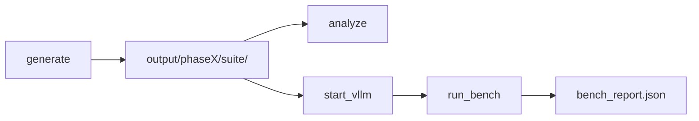

# air_mini_bench — Hướng dẫn đầy đủ

Mini self-bench cho **LLM Inference Optimization Challenge V2** (AI RACE 2026), bám trace kiểu Mooncake và phân tích `air_data`.

Tài liệu bổ sung (cùng nội dung, chia nhỏ):

- [docs/HUONG_DAN_BENCH.md](docs/HUONG_DAN_BENCH.md) — giải thích sâu arrival, prefix cache, metrics, FAQ
- [docs/SCENARIO_CATALOG.md](docs/SCENARIO_CATALOG.md) — bảng tra cứu suite (copy-paste lệnh)

---

## Mục lục

1. [Bench làm gì?](#1-bench-làm-gì)
2. [Thông số phase & workload](#2-thông-số-phase--workload)
3. [Scenario suite — bảng đầy đủ](#3-scenario-suite--bảng-đầy-đủ)
4. [Prefix cache (quan trọng)](#4-prefix-cache-quan-trọng)
5. [Cấu trúc output & file](#5-cấu-trúc-output--file)
6. [Cài đặt](#6-cài-đặt)
7. [Luồng chạy từng bước](#7-luồng-chạy-từng-bước)
8. [Lệnh CLI & scripts](#8-lệnh-cli--scripts)
9. [Metrics & báo cáo](#9-metrics--báo-cáo)
10. [Kiến trúc mã nguồn](#10-kiến-trúc-mã-nguồn)
11. [Chọn suite nào?](#11-chọn-suite-nào)
12. [FAQ & checklist](#12-faq--checklist)
13. [Tham chiếu](#13-tham-chiếu)

---

## 1. Bench làm gì?

Ba bước chính:

| Bước | Công cụ | Kết quả |
|------|---------|---------|
| **Sinh dữ liệu** | `bench.generate` | Trace + prompt (JSON/base64) theo từng **suite** |
| **Phân tích offline** | `bench.analyze` | Thống kê token, arrival, prefix cache |
| **Replay + chấm** | `bench.run_bench` / `run_scenarios` | Gọi vLLM (streaming), ERC, TTFT/TBT |



Mỗi **suite** = một kịch bản test riêng (mix workload + arrival + cách tạo prompt), nằm trong thư mục `output/<phase>/<tên_suite>/`.

---

## 2. Thông số phase & workload

| Phase | Requests | Warmup | Probe slots | Workload |
|-------|----------|--------|-------------|----------|
| **phase1** | 250 | **5%** (bench; đề ~10%) | ~8% | Conversation **60%** + Tool&Agent **40%** (không long-context) |
| **phase2** | 500 | **5%** | ~8% | Conv **~31%** + Tool **~59%** + Long-context **~10%** |

**Workload type**

| Loại | Ý nghĩa | Input điển hình (`heavy`) |
|------|---------|---------------------------|
| `conversation` | Chat ngắn | ~300 token |
| `tool_agent` | Tool/agent, context dài | ~8k–18k token |
| `long_context` | Chỉ P2 | ~15k–25k token |

**Profile độ dài** (`--length-profile`):

| Profile | Dùng khi |
|---------|----------|
| `heavy` (mặc định) | Stress gần cap 32k, khớp `start_vllm.sh` |
| `realistic` | Median theo Fig.5 đề |
| `compact` / `local` | Smoke test vLLM 8k |
| `contest` | Full đề (long p95 ~78k, cần context rất lớn) |

**SLO mặc định** (`src/bench/config.py`):

| Phase | TTFT | TBT | Timeout request |
|-------|------|-----|-----------------|
| phase1 | 4000 ms | 80 ms | 120 s |
| phase2 | 10000 ms | 200 ms | 300 s |

---

## 3. Scenario suite — bảng đầy đủ

### Phase 2 — Priority (6 suite, generate mặc định)

| Suite | Conv | Tool | LC | Arrival | Cache | Output | Mục tiêu |
|-------|------|------|-----|---------|-------|--------|----------|
| `official_like` | 31% | 59% | 10% | `official_window` (mean 50ms) | — | default | Gần đề P2 nhất |
| `steady_poisson` | 31% | 59% | 10% | `steady_poisson` (50ms) | — | default | Baseline ổn định |
| `microburst` | 31% | 59% | 10% | `microburst` (sóng 6–14, cùng `t`) | — | default | Continuous batching |
| `tool_cache_hot` | 10% | **85%** | 5% | session + **cùng timestamp** | **hot** | default | Prefix KV reuse |
| `decode_pressure` | **80%** | 20% | 0% | `steady_poisson` (~35ms) | — | **long_decode** | Decode / TBT |
| `long_context_pressure` | 10% | 40% | **50%** | `lc_spread_poisson` | — | default | Long prefill / HBM |

### Phase 2 — Extended (4 suite, cần `--all-suites`)

| Suite | Conv | Tool | LC | Arrival | Cache | Mục tiêu |
|-------|------|------|-----|---------|-------|----------|
| `tool_cache_cold` | 10% | 85% | 5% | `session_cluster` | **cold** | So sánh với hot |
| `fast_queue` | 31% | 59% | 10% | `steady_poisson` (16ms) | — | Hàng đợi nhanh |
| `large_burst` | 20% | 70% | 10% | `large_burst` (10–25) | — | Stress prefill |
| `flood_admission` | 40% | 55% | 5% | `flood` (tất cả = 0) | — | Admission / OOM |

### Phase 1 — Tất cả (6 suite)

| Suite | Conv | Tool | Arrival | Cache | Output | Mục tiêu |
|-------|------|------|---------|-------|--------|----------|
| `p1_official_like` | 60% | 40% | `official_window` | — | default | Gần đề P1 |
| `p1_steady` | 60% | 40% | `steady_poisson` (50ms) | — | default | Baseline P1 |
| `p1_burst` | 50% | 50% | `large_burst` (10–25) | — | default | Burst batching |
| `p1_tool_cache_hot` | 20% | **80%** | session + cùng `t` | **hot** | default | Prefix cache hot |
| `p1_tool_cache_cold` | 20% | 80% | `session_cluster` | **cold** | default | Prefix cache cold |
| `p1_decode_pressure` | **85%** | 15% | `steady_poisson` (~30ms) | — | **long_decode** | Decode / TBT |

### Kiểu arrival (trong code)

| `arrival` | Hành vi |
|-----------|---------|
| `steady_poisson` | Khoảng cách exponential, `mean_ms` |
| `official_window` | Cắt cửa sổ liên tục từ Poisson dài |
| `microburst` | Sóng `wave_min`–`wave_max` request **cùng** timestamp |
| `large_burst` | Sóng `batch_min`–`batch_max` cùng timestamp |
| `session_cluster` | Request cùng session đến gần nhau |
| `lc_spread_poisson` | Poisson, không gom 2 long-context cùng `t` |
| `flood` | Mọi request `timestamp = 0` |

Định nghĩa suite: `src/bench/domain/scenario.py`. Thuật toán timestamp: `src/bench/arrivals.py`.

**Số liệu tham khảo** (profile `heavy`, seed 42): mean input tổng ~8–9k (bị kéo bởi conv); `tool_agent` ~9–11k; `long_context` ~14–20k. `microburst` max concurrent ~14; `tool_cache_hot` ~8.

---

## 4. Prefix cache (quan trọng)

vLLM/SGLang cache theo **token prefix thật**, không theo field `hash_ids` trong trace.

| Cách | Cache hit? |
|------|------------|
| `hash_ids` giống nhưng **text khác** | Không |
| **Cùng đoạn text** đầu prompt, chỉ khác phần sau | Có |

Suite `tool_cache_hot` / `p1_tool_cache_hot` tạo prompt:

```text
[SHARED_SYSTEM_PREFIX_sess-0003]
... ~8000 token nội dung giống nhau ...
[USER_QUESTION_0007]
Compute 123 + 456. Reply with the integer only.
```

- **Hot**: nhiều request trong session dùng chung prefix; replay **cùng timestamp** trong session (~batch 4–8).
- **Cold**: mỗi request prefix riêng (`cold-00042`) — so sánh hit rate.

Generator còn sắp xếp thứ tự replay: tool cùng session **liền kề**, và verify prefix text trước khi ghi trace.

---

## 5. Cấu trúc output & file

```text
air_mini_bench/
  output/
    manifest.json                 # sau generate --phase all
    analysis_summary.json         # sau bench.analyze --phase all
    phase1/
      suites_manifest.json
      p1_steady/
        index.json                # thứ tự replay + metadata/request
        trace.jsonl               # Trace công khai: timestamp, lengths, hash_ids (giống đề)
        payloads/r-00001.json     # Replay: prompt_b64 + hash_ids (prompt đầy đủ cho vLLM)
        probes.jsonl              # ~8% probe slots
        prompts.jsonl             # export text (debug)
        trace_meta.json           # spec suite + arrival_analysis + prefix_cache
        dataset_analysis.json     # sau analyze
        bench_report.json         # sau run_bench
        request_metrics.jsonl     # per-request ttft/tbt/effective
      p1_tool_cache_hot/
      ...
    phase2/
      official_like/
      steady_poisson/
      tool_cache_hot/
      ...
      runs/
        scenario_summary.json     # sau run_scenarios.sh
```

| File | Khi đọc |
|------|---------|
| `dataset_analysis.json` | Trước chạy LLM — phân bổ input, max batch cùng timestamp |
| `trace_meta.json` | Spec suite + thống kê prefix cache |
| `bench_report.json` | Sau replay — ERC, latency, score |
| `request_metrics.jsonl` | Debug từng request |

### Trace vs payload (không nhầm `utf-8+b64` với thiếu `hash_ids`)

| Artifact | Nội dung | Giống đề Mooncake? |
|----------|----------|-------------------|
| **`trace.jsonl`** | `timestamp`, `input_length`, `hash_ids`, `is_warmup` — **không** có prompt text | Có (trace công khai) |
| **`payloads/*.json`** | `prompt_b64` + `encoding: utf-8+b64` + **`hash_ids`** — dùng khi replay gọi vLLM | Bench riêng (đề gửi prompt qua kênh khác) |
| **`index.json`** | Thứ tự replay + metadata (có `hash_ids`, đường dẫn payload) | Bench |

`hash_ids` = CRC32 theo block ~512 token (`src/bench/tokens.py`), dùng phân tích prefix reuse trên trace. **Replay vẫn cần `prompt_b64`** để gửi nội dung thật tới API.

**Lưu ý đường dẫn:** dùng `output/phase2/steady_poisson/`, **không** `output/phase2/payloads/` (layout cũ, không có suite/arrival).

**Lưu ý:** `run_bench` đọc `output/<phase>/<suite>/`. File `output/phase1/bench_report.json` cũ (layout flat) là legacy.

---

## 6. Cài đặt

```bash
cd air_mini_bench
pip install -r requirements.txt
export PYTHONPATH=src   # hoặc dùng scripts (đã set sẵn)
```

**Dataset HuggingFace** (khuyến nghị — probe LEval/LooGLE có nghĩa):

```bash
cd ../air_data
pip install -r requirements.txt
python3 src/data/down_data.py L4NLP/LEval --config gsm100
python3 src/data/down_data.py bigai-nlco/LooGLE --config shortdep_qa
python3 src/data/down_data.py bigai-nlco/LooGLE --config longdep_qa
```

Không có HF data: generator dùng prompt synthetic (`hf_data_used: false` trong `trace_meta.json`). ERC và latency vẫn hợp lệ; **Score probe** thường ≈ 0.

---

## 7. Luồng chạy từng bước

### Bước 1 — Sinh dữ liệu (một lần / khi đổi seed hoặc profile)

```bash
cd air_mini_bench

# P1 + P2, tất cả suite ưu tiên, profile heavy
./scripts/generate_scaled.sh

# Hoặc thủ công:
PYTHONPATH=src python -m bench.generate --phase all --seed 42 --length-profile heavy

# Một suite
PYTHONPATH=src python -m bench.generate --phase phase2 --suite tool_cache_hot --seed 42

# Thêm 4 suite mở rộng P2
PYTHONPATH=src python -m bench.generate --phase phase2 --all-suites --seed 42

# Smoke test context 8k
PYTHONPATH=src python -m bench.generate --length-profile compact --max-context-tokens 8192
```

| Tham số | Mặc định | Ý nghĩa |
|---------|----------|---------|
| `--seed` | 42 | Reproducible |
| `--warmup-ratio` | 0.05 | Warmup (ví dụ 0.05 → P2 có 25 warmup / 475 scored) |
| `--length-profile` | `heavy` | Độ dài input/output |
| `--max-context-tokens` | 32768 | Khớp `vLLM --max-model-len` |
| `--suite` | — | Chỉ sinh một suite |
| `--all-suites` | off | P2 thêm 4 suite extended |

### Bước 2 — Phân tích dataset (không cần GPU)

```bash
PYTHONPATH=src python -m bench.analyze --phase all
PYTHONPATH=src python -m bench.analyze --phase phase2 --suite long_context_pressure
```

Xem `input_tokens.by_workload`, `arrival.concurrent_starts.max_at_one_timestamp`, `prefix_cache`.

### Bước 3 — vLLM (terminal A)

```bash
./scripts/cleanup_vllm.sh    # nếu crash trước / còn VLLM::Worker
./scripts/start_vllm.sh      # Qwen2.5-3B, TP=1, max-model-len 32768
```

| Tham số | Khuyến nghị | Ghi chú |
|---------|-------------|---------|
| `--max-model-len` | **32768** | Khớp bench `heavy` |
| `--tensor-parallel-size` | **1** | TP=2 trên topo PHB hay lỗi NCCL |
| `--gpu-memory-utilization` | tự tính | Script đọc `nvidia-smi` |

Tuỳ chỉnh: `VLLM_MAX_MODEL_LEN=28672`, `VLLM_TENSOR_PARALLEL_SIZE=2`, `VLLM_GPU_MEMORY_UTILIZATION=0.85`.

### Bước 4 — Replay bench (terminal B)

```bash
export AIR_MINI_BENCH_BASE_URL=http://127.0.0.1:8000
export AIR_MINI_BENCH_API_KEY=EMPTY
export AIR_MINI_BENCH_MODEL=Qwen/Qwen2.5-3B-Instruct

# Mặc định suite: p1_steady (P1) / steady_poisson (P2)
PYTHONPATH=src python -m bench.run_bench --phase phase1 --suite p1_steady
PYTHONPATH=src python -m bench.run_bench --phase phase2 --suite official_like

# Thử nhanh
PYTHONPATH=src python -m bench.run_bench --phase phase2 --suite microburst --max-requests 20

# Tất cả suite ưu tiên phase2
./scripts/run_scenarios.sh phase2
MAX_INFLIGHT=8 ./scripts/run_scenarios.sh phase2   # burst/flood

# Không cần server
PYTHONPATH=src python -m bench.run_bench --phase phase1 --dry-run
```

| Flag | Ý nghĩa |
|------|---------|
| `--suite` | Tên thư mục under `output/<phase>/` |
| `--no-realtime` | Gửi nối đuôi, **không** sleep theo timestamp (stress, không giống đề) |
| `--max-requests` | Cắt N request đầu |
| `--max-inflight` | Giới hạn HTTP concurrent |
| `--baseline-mean` | 0.831 — F1 baseline cho accuracy_drop |

**Realtime vs đề:** Mặc định replay **chờ** theo `timestamp` (ms), request cùng `t` gửi **đồng thời** (`asyncio.gather`). `--no-realtime` bỏ sleep — chỉ dùng stress throughput.

---

## 8. Lệnh CLI & scripts

| Lệnh / script | Mô tả |
|---------------|--------|
| `python -m bench.generate` | Sinh suite(s) |
| `python -m bench.analyze` | Phân tích dataset (+ optional `--run-metrics`) |
| `python -m bench.run_bench` | Replay một suite |
| `python -m bench.run_scenarios` | Replay lần lượt nhiều suite |
| `./scripts/generate_scaled.sh` | generate all + analyze |
| `./scripts/generate_all.sh` | generate với seed tùy chọn |
| `./scripts/run_scenarios.sh phase1\|phase2` | Chạy priority suites |
| `./scripts/start_vllm.sh` | Khởi động vLLM OpenAI API |
| `./scripts/cleanup_vllm.sh` | Dọn worker cũ / VRAM |

---

## 9. Metrics & báo cáo

### ERC (Effective Request Count)

Request **scored** = không warmup. **Effective** khi: có ≥1 output token, TTFT ≤ SLO, TBT ≤ SLO.

```text
ERC = số effective / số scored
```

`bench_report.json` có `erc.by_workload` (conversation / tool_agent / long_context).

### Latency

| Metric | Ý nghĩa |
|--------|---------|
| **TTFT** | Thời gian tới token đầu (prefill + queue) |
| **TBT** | Median gap giữa các token stream (decode) |
| **wall_time_s** | Tổng thời gian chạy suite |

Báo cáo: p50 / p90 / p95 cho TTFT và TBT; đếm `slo_fail_ttft` / `slo_fail_tbt`.

### Score (đề Section 6.4)

```text
Score = 100 × ERC × f(accuracy_drop)
```

`accuracy_drop` từ probe (~8% slot): LEval F1/EM, LooGLE F1/ROUGE-L. Cần HF data thật; synthetic → thường **Score ≈ 0** dù ERC 100%.

Khi chỉ tối ưu inference: theo dõi **ERC + latency**; score probe sau khi có LEval/LooGLE.

### Đối chiếu đề

- Trace: `timestamp`, `input_length`, `output_length`, `hash_ids` (block 512 token)
- Warmup 5% mặc định bench (`--warmup-ratio 0.10` nếu muốn giống đề), probe ~8%
- `decoder_config.json` — temperature 0 (fixed decode)

---

## 10. Kiến trúc mã nguồn

```text
src/bench/
  domain/                    # Models (không gọi HTTP)
    scenario.py              # ScenarioSpec + catalog P1/P2
    report.py                # RequestResult, BenchReport
    suite.py                 # GenerationConfig, SuitePaths
  services/                  # Use cases
    trace_generator.py       # TraceGenerator — sinh trace/payload
    replay_engine.py         # ReplayEngine — streaming API replay
    dataset_analyzer.py      # DatasetAnalyzer — thống kê dataset
  config.py                  # PhaseSpec, SLO, length profiles
  arrivals.py                # Thuật toán timestamp
  prompt_builder.py          # Shared prefix text (tool cache)
  trace_lengths.py, probes_util.py, metrics.py, storage.py, tokens.py, hf_sources.py
  generate.py, analyze.py, run_bench.py, run_scenarios.py   # CLI mỏng
  scenarios.py, suite_generate.py, replay.py                 # shim import cũ
```

**API programmatic:**

```python
from bench import TraceGenerator, ReplayEngine, GenerationConfig
from bench.domain import get_suite
from bench.config import PHASES, DEFAULT_HF_ROOT

gen = TraceGenerator(DEFAULT_HF_ROOT, GenerationConfig(length_profile="heavy"))
gen.generate_suite(get_suite("phase2", "steady_poisson"), PHASES["phase2"], out_dir, seed=42)

# report = await ReplayEngine(suite_dir, base_url=..., api_key=..., model=...).run()
```

---

## 11. Chọn suite nào?

| Mục tiêu | Suite gợi ý |
|----------|----------------|
| Giống đề P2 | `official_like`, `steady_poisson` |
| Stress scheduler / batching | `microburst`, `large_burst`, `p1_burst` |
| Test prefix cache | `tool_cache_hot` vs `tool_cache_cold` (P1: `p1_tool_cache_*`) |
| Test decode / TBT | `decode_pressure`, `p1_decode_pressure` |
| Test long context (P2) | `long_context_pressure` |
| Admission / OOM | `flood_admission` + `MAX_INFLIGHT` |

Phase 1 **không** dùng suite P2 (không long-context, mix khác).

---

## 12. FAQ & checklist

**Mean input tổng thấp (~8k)?**  
Mean bị kéo bởi ~30% conversation (~300 token). Xem `by_workload` trong `dataset_analysis.json`.

**OOM khi burst/flood?**  
`MAX_INFLIGHT=4` hoặc `8`; `--max-requests 50` thử trước.

**Probe / Score = 0?**  
`hf_data_used: false` → reference synthetic. Cài LEval/LooGLE rồi generate lại.

**Checklist**

- [ ] `./scripts/generate_scaled.sh`
- [ ] `python -m bench.analyze --phase all`
- [ ] `./scripts/start_vllm.sh` (max-model-len 32768)
- [ ] `run_bench --suite p1_steady` hoặc `steady_poisson` — smoke
- [ ] `./scripts/run_scenarios.sh phase2` — so sánh suite
- [ ] Đọc `bench_report.json` + `request_metrics.jsonl`

---

## 13. Tham chiếu

| Tài liệu | Đường dẫn |
|----------|-----------|
| Đề thi | `LLM_Inference_Optimization_Challenge_v2 (1).docx.pdf` |
| Phân tích air_data | `air_data/reports/BAO_CAO_PHAN_TICH_CUOC_THI_LLM_INFERENCE_OPTIMIZATION.md` |
| Hướng dẫn chi tiết | [docs/HUONG_DAN_BENCH.md](docs/HUONG_DAN_BENCH.md) |
| Catalog suite | [docs/SCENARIO_CATALOG.md](docs/SCENARIO_CATALOG.md) |
| Cấu hình SLO/phase | `src/bench/config.py` |
