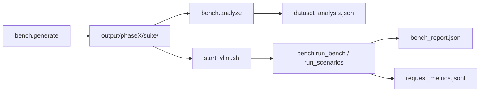

# Hướng dẫn air_mini_bench — Scenario, workload & metrics

Tài liệu này giải thích **cách bench hoạt động**, **ý nghĩa từng scenario suite**, và **cách chạy từng bước**.

**README tổng hợp (mục lục + bảng suite + luồng chạy):** [README.md](../README.md).

---

## 1. Bench này làm gì?

`air_mini_bench` mô phỏng thu nhỏ **LLM Inference Optimization Challenge V2** (trace kiểu Mooncake):

1. **Sinh trước** trace + prompt (JSON, base64) — mỗi **scenario suite** một bộ dữ liệu riêng.
2. **Replay** theo `timestamp`: gọi API OpenAI-compatible (vLLM), đo TTFT / TBT.
3. **Chấm** ERC (Effective Request Count), latency SLO, và (nếu có probe thật) accuracy.

| Phase | Số request | Workload mặc định (đề) |
|-------|------------|-------------------------|
| **phase1** | 250 | Conversation 60% + Tool&Agent 40% |
| **phase2** | 500 | Conv ~31% + Tool ~59% + Long-context ~10% |

Mỗi phase có **10% warmup** (không tính vào ERC).

---

## 2. Từ khóa quan trọng

### 2.1 Phase vs Suite (scenario)

- **Phase** (`phase1`, `phase2`): quy mô và loại workload tổng thể (P2 có long-context).
- **Suite** (scenario): một **kịch bản test** — khác nhau ở:
  - **Mix workload** (% conv / tool / long)
  - **Arrival** (cách request đến theo thời gian)
  - **Cách tạo prompt** (đặc biệt prefix cache)

Mỗi suite nằm trong một thư mục:

```text
output/phase2/steady_poisson/
output/phase2/tool_cache_hot/
output/phase1/p1_steady/
```

Không còn mô hình cũ “một trace chung + file `scenarios/contest.json` chỉ đổi timestamp”.

### 2.2 Workload type

| Loại | Ý nghĩa đề | Input điển hình (profile `heavy`) |
|------|------------|-----------------------------------|
| `conversation` | Chat ngắn | ~300 token |
| `tool_agent` | Tool / agent, context dài | ~8k–18k token |
| `long_context` | Chỉ phase2, tail dài | ~15k–25k token |

Profile sinh dữ liệu:

- `heavy` (mặc định): đẩy input tool/long lên gần cap 32k.
- `realistic`: median theo Fig.5 đề.
- `compact` / `local`: cho vLLM 8k (smoke test).

### 2.3 Arrival (thời điểm gửi request)

Trường `timestamp` trong trace (đơn vị **ms**, tăng dần từ 0):

- Request **cùng `timestamp`** → replay **gửi đồng thời** (async), tạo áp lực batching / queue.
- Request **khác timestamp** → chờ đủ khoảng cách rồi mới gửi nhóm tiếp theo.

Các kiểu arrival được implement trong `src/bench/arrivals.py`:

| Kiểu | Mô tả ngắn |
|------|-------------|
| `steady_poisson` | Khoảng cách exponential, mean ~50ms |
| `official_window` | Cắt một **cửa sổ liên tục** từ Poisson dài (giữ tương quan thời gian) |
| `microburst` | Sóng 6–14 request **cùng** timestamp |
| `large_burst` | Sóng 10–25 request cùng timestamp |
| `session_cluster` | Request cùng session đến gần nhau (gap nhỏ) |
| `lc_spread_poisson` | Poisson nhưng **không** gom 2 long-context cùng timestamp |
| `flood` | Mọi request `timestamp = 0` |

### 2.4 `hash_ids` vs prefix cache thật

Đề dùng `hash_ids` (mỗi block 512 token) để **phân tích** reuse prefix mà không lộ prompt.

**Quan trọng khi tự tạo prompt:**

| Cách | Prefix cache trên vLLM/SGLang |
|------|-------------------------------|
| Sai: copy `hash_ids` giống nhau nhưng **text khác** | Không reuse (runtime hash token thật) |
| Đúng: **cùng đoạn text** ở đầu prompt, chỉ khác suffix | Có thể reuse KV / prefix cache |

Suite `tool_cache_hot` / `p1_tool_cache_hot` tạo prompt dạng:

```text
[SHARED_SYSTEM_PREFIX_sess-0003]
... ~8000 token cùng nội dung ...
[USER_QUESTION_0007]
Compute 123 + 456. Reply with the integer only.
```

- **Hot**: nhiều request trong `sess-0003` dùng **cùng** prefix block.
- **Cold**: mỗi request một `cold-00042` → prefix khác hẳn.

Generator còn:

- Sắp xếp replay: tool cùng session **liền kề**.
- `tool_cache_hot`: các request trong session **cùng timestamp** (batch ~4–8).

---

## 3. Cấu trúc thư mục output

```text
air_mini_bench/
  output/
    manifest.json                 # tổng hợp lần generate
    analysis_summary.json         # sau bench.analyze --phase all
    phase1/
      suites_manifest.json
      p1_steady/
        index.json                # thứ tự replay + metadata từng request
        trace.jsonl               # 1 dòng / request (Mooncake fields)
        payloads/r-00001.json     # prompt_b64, lengths, cache_session_id, ...
        probes.jsonl              # ~8% slot probe
        trace_meta.json           # mô tả suite + arrival_analysis
        dataset_analysis.json     # phân bổ token (sau analyze)
        bench_report.json         # sau run_bench (ERC, latency, ...)
        request_metrics.jsonl     # từng request: ttft, tbt, effective, ...
      p1_tool_cache_hot/
      ...
    phase2/
      official_like/
      steady_poisson/
      microburst/
      tool_cache_hot/
      ...
```

### File nên đọc

| File | Khi nào đọc |
|------|-------------|
| `dataset_analysis.json` | Trước khi chạy LLM — xem phân bổ input, max batch |
| `trace_meta.json` | Spec suite + prefix cache stats |
| `bench_report.json` | Sau replay — ERC, TTFT/TBT tổng hợp |
| `request_metrics.jsonl` | Debug từng request |
| `phase*/runs/scenario_summary.json` | Sau `run_scenarios.sh` — so sánh nhiều suite |

---

## 4. Bảng scenario — Phase 2

### 4.1 Sáu suite ưu tiên (nên chạy trước)

| Suite | Mix (C/T/L) | Arrival | Mục tiêu test |
|-------|-------------|---------|----------------|
| `official_like` | 31% / 59% / 10% | Cửa sổ Poisson liên tục | Gần đề thi nhất |
| `steady_poisson` | 31% / 59% / 10% | Exp mean **50ms** | Baseline ổn định, dễ so sánh |
| `microburst` | 31% / 59% / 10% | Sóng **6–14** cùng timestamp | Continuous batching |
| `tool_cache_hot` | 10% / **85%** / 5% | Session + **cùng timestamp** | Prefix cache / KV reuse |
| `decode_pressure` | **80%** / 20% / 0% | Exp ~**35ms**, output dài | Decode throughput, **TBT** |
| `long_context_pressure` | 10% / 40% / **50%** | LC Poisson, không gom LC | HBM, KV, OOM, long prefill |

*C = conversation, T = tool_agent, L = long_context*

**Số liệu tham khảo** (profile `heavy`, đã generate `seed=42`):

| Suite | Mean input (scored) | Max concurrent @ 1 ts |
|-------|----------------------|------------------------|
| `official_like` | ~8.8k | 1 |
| `steady_poisson` | ~9.2k | 1 |
| `microburst` | ~8.9k | **14** |
| `tool_cache_hot` | ~10.5k | **8** |
| `decode_pressure` | ~2.5k | 1 |
| `long_context_pressure` | ~14.2k | 1 |

### 4.2 Bốn suite mở rộng (`--all-suites`)

| Suite | Mix | Arrival | Mục tiêu |
|-------|-----|---------|----------|
| `tool_cache_cold` | 10/85/5 | Session cluster | So sánh với hot — ít cache hit |
| `fast_queue` | 31/59/10 | Exp mean **16ms** | Hàng đợi, TBT khi tải cao |
| `large_burst` | 20/70/10 | Burst **10–25** | Prefill scheduler, tool nặng |
| `flood_admission` | 40/55/5 | **Tất cả t=0** | Admission control, OOM (cẩn thận) |

---

## 5. Bảng scenario — Phase 1

Phase 1 **không có** long-context. Tập trung conv + tool, đặc biệt **prefix caching**.

| Suite | Mix (C/T) | Arrival | Mục tiêu |
|-------|-----------|---------|----------|
| `p1_official_like` | 60% / 40% | Cửa sổ Poisson | Gần P1 đề |
| `p1_steady` | 60% / 40% | Exp 50ms | Baseline |
| `p1_burst` | 50% / 50% | Burst 10–25 | Batching |
| `p1_tool_cache_hot` | 20% / **80%** | Session + cùng timestamp | Prefix cache hot |
| `p1_tool_cache_cold` | 20% / 80% | Session cluster | Prefix cache cold |
| `p1_decode_pressure` | **85%** / 15% | Exp ~30ms, output dài | Decode / TBT |

---

## 6. Luồng làm việc (end-to-end)



### Bước 1 — Sinh dữ liệu

```bash
cd air_mini_bench
export PYTHONPATH=src

# Tất cả suite ưu tiên P1 + P2
./scripts/generate_scaled.sh

# Chỉ một suite
python -m bench.generate --phase phase2 --suite tool_cache_hot --seed 42

# Thêm 4 suite mở rộng P2
python -m bench.generate --phase phase2 --all-suites --seed 42
```

Tham số hữu ích:

| Tham số | Mặc định | Ý nghĩa |
|---------|----------|---------|
| `--length-profile` | `heavy` | Độ dài input |
| `--max-context-tokens` | `32768` | Khớp `vLLM --max-model-len` |
| `--seed` | `42` | Reproducible |

### Bước 2 — Phân tích dataset (không cần GPU)

```bash
python -m bench.analyze --phase all
python -m bench.analyze --phase phase2 --suite long_context_pressure
```

Mở `dataset_analysis.json` để xem:

- `input_tokens.overall` / `by_workload` (mean, p50, p95, histogram)
- `arrival.concurrent_starts.max_at_one_timestamp` — độ “dồn” request
- `prefix_cache` — số session, session có ≥2 request, prefix text đã verify

### Bước 3 — Chạy vLLM (terminal A)

```bash
./scripts/cleanup_vllm.sh    # nếu lần trước crash / còn worker cũ
./scripts/start_vllm.sh      # Qwen2.5-3B, TP=1, max-model-len 32768
```

### Bước 4 — Replay bench (terminal B)

```bash
export AIR_MINI_BENCH_BASE_URL=http://127.0.0.1:8000
export AIR_MINI_BENCH_MODEL=Qwen/Qwen2.5-3B-Instruct

# Một suite (realtime = chờ theo timestamp trong trace)
python -m bench.run_bench --phase phase2 --suite steady_poisson

# Thử nhanh 20 request
python -m bench.run_bench --phase phase2 --suite microburst --max-requests 20

# Tất cả suite ưu tiên của phase2
./scripts/run_scenarios.sh phase2

# Giới hạn concurrent (tránh OOM khi burst/flood)
MAX_INFLIGHT=8 ./scripts/run_scenarios.sh phase2
```

**Lưu ý đường dẫn:** `run_bench` đọc từ `output/<phase>/<suite>/`, không phải `output/<phase>/` trực tiếp.

| Flag | Ý nghĩa |
|------|---------|
| `--suite` | Tên thư mục suite (mặc định: `p1_steady` / `steady_poisson`) |
| `--no-realtime` | Bỏ sleep theo timestamp — gửi nối đuôi (stress, không giống đề) |
| `--dry-run` | Không gọi API — metric giả |
| `--max-inflight` | Giới hạn số request HTTP song song |
| `--max-requests` | Cắt N request đầu |

---

## 7. Metrics & báo cáo

### 7.1 ERC (Effective Request Count)

Request được tính **scored** (không warmup) và **effective** khi:

- Có output (≥ 1 token),
- `TTFT ≤ SLO`,
- `TBT ≤ SLO` (median gap giữa các token stream).

| Phase | SLO TTFT | SLO TBT |
|-------|----------|---------|
| phase1 | 4000 ms | 80 ms |
| phase2 | 10000 ms | 200 ms |

Chỉnh trong `src/bench/config.py` nếu cần hiệu chỉnh theo stack của bạn.

```text
ERC = (số effective) / (số scored)
```

`bench_report.json` có thêm `erc.by_workload` (conv / tool / long).

### 7.2 Latency

| Metric | Ý nghĩa |
|--------|---------|
| **TTFT** | Thời gian tới token đầu tiên |
| **TBT** | Median khoảng cách giữa các token (decode) |
| **wall_time_s** | Tổng thời gian chạy cả suite |

Báo cáo gồm p50 / p90 / p95 cho TTFT và TBT.

### 7.3 Score (theo đề)

```text
Score = 100 × ERC × f(accuracy_drop)
```

- `accuracy_drop` từ probe LEval/LooGLE (cần dataset HF thật; synthetic thường **Score ≈ 0**).
- Khi chỉ tối ưu inference: **theo dõi ERC + latency**, bỏ qua score probe nếu chưa có HF data.

### 7.4 `request_metrics.jsonl`

Mỗi dòng một request (không lưu full completion để nhẹ file):

```json
{
  "request_id": "r-00042",
  "workload_type": "tool_agent",
  "input_length": 9914,
  "scheduled_timestamp_ms": 1200,
  "ttft_ms": 850.2,
  "tbt_ms": 45.1,
  "output_tokens": 12,
  "effective": true,
  "cache_session_id": "sess-0007"
}
```

---

## 8. So sánh suite — chọn suite nào?

```text
Muốn giống đề P2          → official_like hoặc steady_poisson
Muốn stress scheduler      → microburst, large_burst
Muốn test prefix cache     → tool_cache_hot vs tool_cache_cold
Muốn test decode / TBT     → decode_pressure (P1: p1_decode_pressure)
Muốn test long context    → long_context_pressure (chỉ P2)
Muốn test OOM / admission  → flood_admission (dùng MAX_INFLIGHT)
```

**Phase 1** không dùng suite P2 (không có long-context, mix khác).

---

## 9. Mã nguồn — đọc file nào?

| File | Vai trò |
|------|---------|
| `src/bench/domain/scenario.py` | Định nghĩa toàn bộ suite (`ScenarioSpec`) |
| `src/bench/services/trace_generator.py` | Sinh trace + payload (`TraceGenerator`) |
| `src/bench/prompt_builder.py` | Shared prefix text cho tool cache |
| `src/bench/arrivals.py` | Thuật toán timestamp |
| `src/bench/services/replay_engine.py` | Gọi API, concurrent theo timestamp |
| `src/bench/services/dataset_analyzer.py` | Phân tích dataset / run metrics |
| `src/bench/run_bench.py` | CLI chạy một suite |
| `src/bench/run_scenarios.py` | CLI chạy lần lượt nhiều suite |
| `src/bench/scenarios.py`, `suite_generate.py`, `replay.py` | Shim import tương thích cũ |

---

## 10. FAQ

### Mean input “chỉ vài k” trong báo cáo cũ?

Mean **tổng** bị kéo xuống vì ~30% conversation (~300 token). Xem `by_workload` trong `dataset_analysis.json`:

- `tool_agent.mean` thường ~9k–11k (heavy),
- `long_context.mean` có thể ~14k–20k.

### `--no-realtime` khác gì?

| Chế độ | Hành vi |
|--------|---------|
| Realtime (mặc định) | Sleep theo `timestamp` → giống trace Mooncake |
| `--no-realtime` | Gửi liên tiếp, không chờ → queue stress, **không** giống đề |

### Chạy `flood` / `microburst` bị OOM?

- Dùng `MAX_INFLIGHT=4` hoặc `8` khi gọi `run_scenarios.sh`.
- Hoặc `--max-requests 50` để thử trước.
- `long_context_pressure` + `flood` cùng lúc rất nặng — tránh.

### Probe / accuracy = 0?

Generator đang `hf_data_used: false` → câu hỏi synthetic, reference không khớp model. ERC và latency vẫn hợp lệ. Cài LEval/LooGLE (xem README) rồi generate lại nếu cần score có nghĩa.

### Đổi model / port

```bash
export AIR_MINI_BENCH_BASE_URL=http://127.0.0.1:8000
export AIR_MINI_BENCH_MODEL=Qwen/Qwen2.5-3B-Instruct
```

---

## 11. Checklist nhanh

- [ ] `./scripts/generate_scaled.sh`
- [ ] `python -m bench.analyze --phase all` — kiểm tra mean input / max batch
- [ ] `./scripts/start_vllm.sh` — `max-model-len 32768`
- [ ] `run_bench --suite steady_poisson` — smoke test
- [ ] `./scripts/run_scenarios.sh phase2` — full so sánh suite
- [ ] Đọc `bench_report.json` + `request_metrics.jsonl` — ERC & TTFT/TBT

---

## 12. Tham chiếu

- Đề: `LLM_Inference_Optimization_Challenge_v2 (1).docx.pdf`
- Phân tích dữ liệu: `air_data/reports/BAO_CAO_PHAN_TICH_CUOC_THI_LLM_INFERENCE_OPTIMIZATION.md`
- Cấu hình phase/SLO: `src/bench/config.py`
- Catalog suite (machine-readable): `src/bench/scenarios.py`
