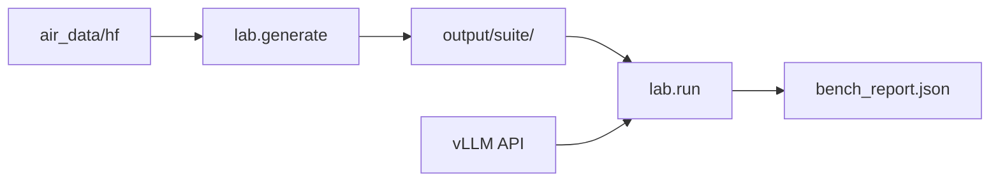

# air_scenario_lab

Mini benchmark cho **LLM Inference Optimization Challenge V2** — sinh trace theo kịch bản, replay lên vLLM API, tính **ERC / latency / score**.

**Khác `air_mini_bench`:** chỉ dùng **prompt thật** từ [`air_data/data/hf`](../air_data/data/hf/), không synthetic fallback, không padding `" word"`.

---

## Mục lục

1. [air_scenario_lab làm gì?](#1-air_scenario_lab-làm-gì)
2. [Khái niệm cần biết](#2-khái-niệm-cần-biết)
3. [Kiến trúc & luồng chạy](#3-kiến-trúc--luồng-chạy)
4. [Cài đặt](#4-cài-đặt)
5. [Hướng dẫn từng bước](#5-hướng-dẫn-từng-bước)
6. [Cấu hình scenario](#6-cấu-hình-scenario)
7. [Đọc kết quả & metrics](#7-đọc-kết-quả--metrics)
8. [Output files](#8-output-files)
9. [CLI reference](#9-cli-reference)
10. [vLLM logging](#10-vllm-logging)
11. [FAQ & troubleshooting](#11-faq--troubleshooting)
12. [So sánh với contest / air_mini_bench](#12-so-sánh-với-contest--air_mini_bench)

---

## 1. air_scenario_lab làm gì?

Ba bước chính:

| Bước | Lệnh | Mô tả |
|------|------|-------|
| **Generate** | `lab.generate` | Sinh trace + payloads từ HF data thật |
| **Replay** | `lab.run` | Đẩy request lên vLLM (streaming API), đo latency |
| **Summarize** | `lab.summarize` | Xem lại kết quả cũ (không cần GPU) |



Mục tiêu: luyện tập tối ưu inference (scheduler, prefix cache, batching…) trên workload **giống contest** nhưng scale nhỏ hơn (~500 req).

---

## 2. Khái niệm cần biết

### 2.1. ERC — Effective Request Capacity

Tỷ lệ request vừa **có output** vừa **đạt SLO latency**.

```
ERC = N_effective / N_scored
```

**Request effective** khi đồng thời:

1. `TTFT ≤ SLO_TTFT`
2. `TBT ≤ SLO_TBT`
3. `output_tokens ≥ 1`

**Không tính vào mẫu số ERC:** request **warmup** (~10% đầu trace).

| Phase | SLO TTFT | SLO TBT |
|-------|----------|---------|
| phase1 | 4,000 ms | 80 ms |
| phase2 | 10,000 ms | 200 ms |

**Ví dụ:** ERC 100% (450/450) = mọi request scored đều trả lời kịp trong ngưỡng SLO.

---

### 2.2. TTFT — Time To First Token

Thời gian từ lúc gửi request đến **token đầu tiên**.

- Chủ yếu phản ánh **prefill** (xử lý prompt dài).
- Prompt 25k token (long-context) → TTFT cao hơn nhiều so với 64 token (conversation).
- Dùng **p50 / p90 / p95** để xem tail latency (request chậm nhất).

---

### 2.3. TBT — Time Between Token

Khoảng thời gian trung bình giữa các token **sau token đầu** (decode speed).

- Phản ánh tốc độ **decode** + áp lực concurrent.
- TBT ~10 ms với model nhỏ thường là bình thường; SLO phase2 là 200 ms.

---

### 2.4. Score — Điểm contest (khác ERC)

```
Score = 100 × ERC × f(accuracy_drop)
```

| accuracy_drop | f(Δ) |
|---------------|------|
| ≤ 0.5% | 1.0 |
| 0.5% – 1.5% | giảm tuyến tính 1.0 → 0.5 |
| 1.5% – 2.0% | giảm tuyến tính 0.5 → 0 |
| **≥ 2.0%** | **0 (fail gate)** |

- **accuracy_drop** = baseline probe F1 − submission probe F1.
- Baseline mặc định: **0.831** (MXFP4 contest).
- **ERC 100% nhưng Score 0** = pass latency, fail accuracy (thường gặp với gsm100 khi model trả suy luận dài thay vì số nguyên).

---

### 2.5. Workload types

| Loại | Ý nghĩa contest | Nguồn HF | Độ dài thực tế (ước lượng) |
|------|-----------------|----------|----------------------------|
| `conversation` | Chat ngắn | LEval `instructions` ngắn | ~64 token (p50) |
| `tool_agent` | Tool/agent, few-shot dài | LEval gsm100 (`input` + `instructions`) | ~4,200 token |
| `long_context` | QA trên document dài | LooGLE shortdep + longdep | ~15k–25k token (cap 25k) |

**Lưu ý:** Contest ghi tool median ~8,600 token, nhưng gsm100 thật chỉ ~4,200 token vì không pad filler. Long-context LooGLE thì **100% > 10k token**.

---

### 2.6. Warmup & Probe

| Khái niệm | Mặc định | Vai trò |
|-----------|----------|---------|
| **warmup** | 10% request | Làm nóng GPU/cache; **không tính ERC** |
| **probe slot** | ~8% scored slots | Đo accuracy (F1/EM) so với `reference_answer` |

Probe chỉ gắn trên `tool_agent` và `long_context` (có gold answer).

---

### 2.7. Arrival pattern — tốc độ request

| Tham số | Ý nghĩa |
|---------|---------|
| `arrival: steady_poisson` | Request đến theo exponential gap |
| `mean_ms: 16` | Gap trung bình 16 ms → queue pressure cao |
| `mean_ms: 50` | Baseline nhẹ hơn |

Trace replay **ngủ đúng timestamp** (realtime mode) → mô phỏng production load, không phải gửi liên tục tối đa.

---

### 2.8. Prefix cache (hot vs cold)

| Mode | Hành vi |
|------|---------|
| `cache_mode: hot` | Nhiều tool request trong cùng session dùng **cùng prefix** gsm100 (`input` few-shot giống nhau) → vLLM có thể reuse KV |
| `cache_mode: cold` | Mỗi request prefix khác → so sánh A/B cache hit |

---

## 3. Kiến trúc & luồng chạy

```
air_scenario_lab/
├── configs/scenarios/     # YAML kịch bản
├── scripts/               # start_vllm, check_hf, run_workflow, smoke_test
├── logs/                  # vLLM log (tự tạo khi start)
├── output/<suite>/        # artifacts mỗi lần generate + run
└── src/lab/
    ├── generate.py        # sinh trace
    ├── run.py             # replay API + ERC
    ├── summarize.py       # xem lại report
    ├── sources/hf_prompts.py
    └── services/
        ├── trace_generator.py
        └── api_replay.py
```

---

## 4. Cài đặt

```bash
cd air_scenario_lab
pip install -r requirements.txt
```

Cần **vLLM** cài riêng (không nằm trong requirements):

```bash
pip install vllm   # hoặc theo docs vLLM
```

### Download HF data (bắt buộc)

```bash
cd ../air_data
python3 src/data/down_data.py L4NLP/LEval --config gsm100
python3 src/data/down_data.py L4NLP/LEval --config quality
python3 src/data/down_data.py bigai-nlco/LooGLE --config shortdep_qa
python3 src/data/down_data.py bigai-nlco/LooGLE --config longdep_qa
```

Kiểm tra:

```bash
cd ../air_scenario_lab
./scripts/check_hf_data.sh
```

Phải thấy `"ok": true` và `conversation_pool > 0`.

---

## 5. Hướng dẫn từng bước

### Terminal 1 — Khởi động vLLM

```bash
cd air_scenario_lab
./scripts/start_vllm.sh
```

Log ghi song song ra terminal và file:

- `logs/vllm_YYYYMMDD_HHMMSS.log`
- `logs/vllm_latest.log` (symlink)

Theo dõi log:

```bash
tail -f logs/vllm_latest.log
```

Tuỳ chỉnh:

```bash
VLLM_MODEL=Qwen/Qwen2.5-3B-Instruct \
VLLM_MAX_MODEL_LEN=32768 \
CUDA_VISIBLE_DEVICES=0 \
./scripts/start_vllm.sh
```

### Terminal 2 — Generate trace

```bash
cd air_scenario_lab
PYTHONPATH=src python -m lab.generate \
  --config configs/scenarios/admission_crunch.yaml
```

Kết quả: `output/admission_crunch/` với 500 request, `hf_data_used: true`.

### Terminal 2 — Replay & chấm điểm

```bash
PYTHONPATH=src python -m lab.run \
  --suite admission_crunch \
  --base-url http://127.0.0.1:8000 \
  --model Qwen/Qwen2.5-3B-Instruct
```

Smoke test (10 request):

```bash
PYTHONPATH=src python -m lab.run \
  --suite admission_crunch \
  --base-url http://127.0.0.1:8000 \
  --model Qwen/Qwen2.5-3B-Instruct \
  --max-requests 10
```

### Xem lại run cũ (không cần vLLM)

```bash
PYTHONPATH=src python -m lab.summarize --suite admission_crunch
```

---

## 6. Cấu hình scenario

File YAML mẫu `configs/scenarios/admission_crunch.yaml`:

```yaml
name: admission_crunch
phase: phase2
total_requests: 500
mix:
  conversation: 0.31
  tool_agent: 0.59
  long_context: 0.10
arrival: steady_poisson
arrival_params:
  mean_ms: 16          # tốc độ: nhỏ = áp lực queue cao
cache_mode: hot        # prefix cache: hot | cold | null
warmup_ratio: 0.10
probe_slot_ratio: 0.08
length_profile: realistic
slo_ttft_ms: 10000
slo_tbt_ms: 200
seed: 42
```

### Suite có sẵn

| Suite | mean_ms | cache | Mục tiêu |
|-------|---------|-------|----------|
| `admission_crunch` | 16 | hot | Stress queue + prefix cache |
| `admission_crunch_cold` | 16 | cold | A/B so sánh cache |
| `steady_baseline` | 50 | hot | Baseline nhẹ, ERC dễ cao |

### Override nhanh (CLI)

```bash
PYTHONPATH=src python -m lab.generate \
  --config configs/scenarios/admission_crunch.yaml \
  --mean-ms 25 \
  --requests 200 \
  --mix conversation=0.2,tool_agent=0.7,long_context=0.1
```

| Flag | Ý nghĩa |
|------|---------|
| `--mean-ms` | Tốc độ arrival (ms) |
| `--requests` | Tổng số request |
| `--mix` | Tỷ lệ workload |
| `--seed` | Reproducible shuffle |

---

## 7. Đọc kết quả & metrics

Sau `lab.run`, terminal in **Bench Summary**. Ví dụ giải thích:

```
ERC: 100.0% (450/450)
```
→ 450 request scored (500 − 50 warmup), tất cả đạt SLO.

```
TTFT p50: 126 ms   p95: 2259 ms
```
→ Một nửa request TTFT ≤ 126 ms; 5% chậm nhất ~2.3s (thường do long-context ~25k token).

```
TBT p50: 10.9 ms
```
→ Decode rất nhanh, xa ngưỡng SLO 200 ms.

```
throughput: 0.78 req/s
```
→ 500 req / ~638s wall time (bao gồm sleep theo timestamp trace).

```
Score: 0.0
Reason: accuracy_gate_fail: drop 83.10% >= 2%
```
→ ERC pass nhưng probe F1 quá thấp so baseline → Score = 0.

### ERC theo workload (debug)

| Workload | Ý nghĩa khi đọc |
|----------|-----------------|
| conversation in_p50 ~64 | Prompt ngắn, TTFT ~20ms |
| tool_agent in_p50 ~4263 | gsm100 few-shot; cache hot giúp session sau |
| long_context in_p50 ~24920 | Prefill nặng, TTFT p50 ~2s |

### Khi nào ERC giảm?

- `mean_ms` nhỏ (16) + nhiều request overlap
- Model lớn hơn / GPU ít hơn
- Long-context chiếm tỷ lệ cao
- Prefix cache cold vs hot (TTFT tool tăng)

---

## 8. Output files

```
output/<suite_name>/
├── trace.jsonl              # public trace (không có prompt text)
├── payloads/r-*.json        # prompt_b64 + reference_answer
├── index.json               # thứ tự replay + metadata
├── trace_meta.json          # mix, arrival stats, hf_data_used
├── probes.jsonl             # probe slots
├── bench_report.json        # ERC, latency, score, debug
├── request_metrics.jsonl    # per-request TTFT/TBT/effective
└── probe_details.jsonl      # gold vs completion preview (sau lab.run)
```

### Đọc nhanh từng file

| File | Dùng khi |
|------|----------|
| `trace_meta.json` | Kiểm tra mix, arrival gap, prefix cache stats |
| `bench_report.json` | Tổng hợp ERC/score; xem section `debug` |
| `request_metrics.jsonl` | Debug từng request: `effective`, `ttft_ms`, `error` |
| `probe_details.jsonl` | Hiểu vì sao Score = 0 (gold vs model output) |
| `logs/vllm_latest.log` | OOM, batching, prefill/decode trên server |

---

## 9. CLI reference

| Lệnh | Mô tả |
|------|-------|
| `python -m lab.check_hf` | Kiểm tra dataset HF |
| `python -m lab.generate` | Sinh suite |
| `python -m lab.run` | Replay lên vLLM + tính ERC |
| `python -m lab.summarize` | Tóm tắt artifacts có sẵn |

### `lab.run` flags

| Flag | Mặc định | Ý nghĩa |
|------|----------|---------|
| `--suite` | (bắt buộc) | Tên thư mục trong `output/` |
| `--base-url` | `http://127.0.0.1:8000` | vLLM endpoint |
| `--model` | (bắt buộc) | Model name khớp vLLM |
| `--max-requests` | all | Giới hạn số request (smoke test) |
| `--max-inflight` | unlimited | Giới hạn concurrent HTTP |
| `--no-realtime` | false | Bỏ sleep timestamp (stress throughput) |
| `--quiet` | false | Chỉ in đường dẫn report |

---

## 10. vLLM logging

`start_vllm.sh` dùng `tee` — vừa in terminal vừa ghi file:

```bash
./scripts/start_vllm.sh
# → logs/vllm_20260605_120000.log
# → logs/vllm_latest.log
```

Tuỳ chỉnh:

```bash
VLLM_LOG_DIR=/tmp/my_logs \
VLLM_LOG_FILE=/tmp/my_logs/run1.log \
./scripts/start_vllm.sh
```

**Trong log vLLM thường quan sát:**
- Model loading, max model len
- Prefill batch size, queue depth
- OOM / KV cache eviction
- Request timing (nếu bật verbose)

---

## 11. FAQ & troubleshooting

### `check_hf_data.sh` fail

Thiếu dataset → chạy `down_data.py` như mục 4. Conversation cần gsm100 (instructions ngắn).

### `lab.run` refuse / hf_data_used false

Regenerate suite sau khi đã có đủ HF data:

```bash
PYTHONPATH=src python -m lab.generate --config configs/scenarios/<suite>.yaml
```

### ERC 100% nhưng Score 0

Bình thường với gsm100: model trả suy luận dài, gold là số ngắn (`"18"`). Xem `probe_details.jsonl`:

```bash
head -3 output/admission_crunch/probe_details.jsonl
```

Cải thiện: temperature=0, prompt “integer only”, hoặc post-process số từ output khi chấm probe.

### TTFT thấp bất thường / ERC quá dễ

- Model nhỏ (3B) + SLO rộng (10s/200ms)
- Chạy `--max-requests 50` không đại diện full load
- Tool chỉ ~4.2k token (chưa ~8.6k contest)

Thử: full 500 req, `mean_ms: 16`, model lớn hơn, hoặc `admission_crunch_cold`.

### vLLM: command not found

```bash
pip install vllm
# hoặc kích hoạt đúng conda env có vllm
```

### Request timeout

Tăng `request_timeout_s` trong `index.json` hoặc giảm `max_tokens` / long-context ratio.

---

## 12. So sánh với contest / air_mini_bench

| | Contest (Mooncake) | air_scenario_lab | air_mini_bench |
|--|-------------------|------------------|----------------|
| Scale | ~39k req (P2) | ~500 req | ~500 req |
| Prompt | Probe từ LEval/LooGLE | HF thật, no filler | Có synthetic fallback |
| Pad token | Không | Không | Có (`" word"`) |
| Tool length | ~8.6k median | ~4.2k (gsm100) | ~8k (padded) |
| ERC test | Portal submission | `lab.run` local | `bench.run_bench` |

**Tham chiếu thêm:**
- [`air_data/reports/BAO_CAO_PHAN_TICH_CUOC_THI_LLM_INFERENCE_OPTIMIZATION.md`](../air_data/reports/BAO_CAO_PHAN_TICH_CUOC_THI_LLM_INFERENCE_OPTIMIZATION.md) — phân tích contest đầy đủ
- [`air_mini_bench/docs/HUONG_DAN_BENCH.md`](../air_mini_bench/docs/HUONG_DAN_BENCH.md) — arrival, prefix cache (khái niệm tương tự)

---

## Scripts tiện ích

```bash
./scripts/check_hf_data.sh          # verify HF
./scripts/start_vllm.sh             # vLLM + log file
./scripts/run_workflow.sh configs/scenarios/steady_baseline.yaml
MAX_REQUESTS=10 ./scripts/run_workflow.sh configs/scenarios/admission_crunch.yaml
PYTHONPATH=src python3 scripts/smoke_test.py   # test không cần GPU
```
